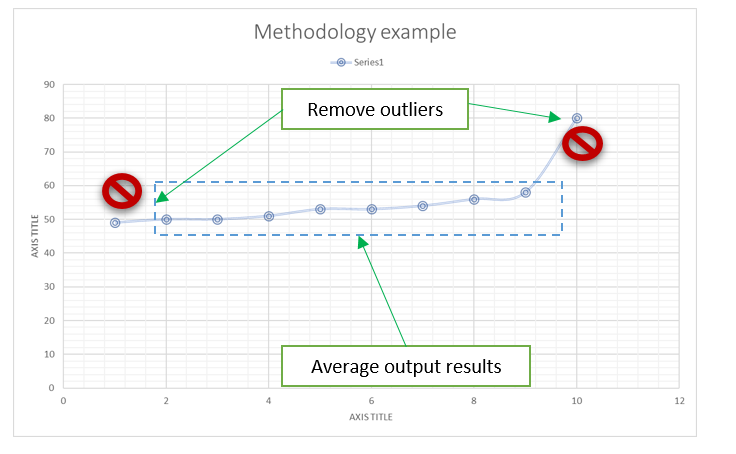

# Benchmark

Benchmarking data collector - run application as child process, collecting stats (time, cpu usage, memory usage)  and generate benchmarking reports.

## High level idea

- run application multiple times
- collect all interested readings:
    - time
    - CPU
    - memory

- process outputs and provide results as:
  - csv/excel
  - graphs

Save outputs to local DB/file to check downgrade/speedup in next release of application.


## Methodology

For each benchmark run:
- run multiple times (default 10)
- remove outliers
- average output results



## Build

```shell
cargo build -r --bin benchmark 
```

## Usage

```shell
benchmark 0.1.0
Benchmarking data collector.

USAGE:
    benchmark [OPTIONS] <APPLICATION>

ARGS:
    <APPLICATION>    Application path (just name if it is in the same directory)

OPTIONS:
    -h, --help           Print help information
    -l, --log <LOG>      Set custom log level: info, debug, trace [default: info]
    -r, --runs <RUNS>    Number of runs to be executed [default: 10]
    -V, --version        Print version information

```


## Example output

```log
09:33:24.899 (t: main) INFO - benchmark - Application to be benchmark is: /opt/workspace/ballista/target/release/examples/example_processing
09:33:24.899 (t: main) INFO - benchmark - Number of runs: 10
09:33:24.902 (t: main) INFO - benchmark - Collecting data::example_processing
09:33:24.902 (t: main) INFO - benchmark::bench::analysis - Run 0 of 10
09:33:24.947 (t: main) INFO - benchmark::bench::analysis - Run 1 of 10
09:33:24.983 (t: main) INFO - benchmark::bench::analysis - Run 2 of 10
09:33:25.016 (t: main) INFO - benchmark::bench::analysis - Run 3 of 10
09:33:25.049 (t: main) INFO - benchmark::bench::analysis - Run 4 of 10
09:33:25.087 (t: main) INFO - benchmark::bench::analysis - Run 5 of 10
09:33:25.132 (t: main) INFO - benchmark::bench::analysis - Run 6 of 10
09:33:25.188 (t: main) INFO - benchmark::bench::analysis - Run 7 of 10
09:33:25.238 (t: main) INFO - benchmark::bench::analysis - Run 8 of 10
09:33:25.288 (t: main) INFO - benchmark::bench::analysis - Run 9 of 10
09:33:25.338 (t: main) INFO - benchmark - Processing outputs
0.04,130,18752,
0.03,140,18664,
0.03,156,18856,
0.03,153,18868,
0.04,152,18884,
0.04,140,18904,
0.05,136,19404,
0.05,145,19220,
0.05,137,18780,
0.05,138,18788,
09:33:25.339 (t: main) INFO - benchmark::bench::collector - SUMMARY:
09:33:25.339 (t: main) INFO - benchmark::bench::collector - Time [ms]:: min: 30, max: 50, avg: 41 ms
09:33:25.339 (t: main) INFO - benchmark::bench::collector - CPU [%]:: min: 130, max: 156, avg: 142.7 %
09:33:25.339 (t: main) INFO - benchmark::bench::collector - Memory [kB]:: min: 18664, max: 19404, avg: 18912 kB

Process finished with exit code 0


```

Also in current directory of benchmark app there is output directory created named "bench_<your_app_name>", ie: bench_example_processing, which contains:

Output csv file:
- [benchmarks.csv](bench_example_processing/benchmarks.csv)

```csv
Time,Cpu,Mem
0.04,130,18752
0.03,140,18664
0.03,156,18856
0.03,153,18868
0.04,152,18884
0.04,140,18904
0.05,136,19404
0.05,145,19220
0.05,137,18780
0.05,138,18788
```

and  output graphs:


- [time.svg](bench_example_processing/time.svg)
  

- [cpu.svg](bench_example_processing/cpu.svg)
  


- [mem.svg](bench_example_processing/mem.svg)
  


TODO:
- incremental runs - use date/time in output dir
- memory - MB instead kB
- add examples with sub parameters
- local db / or file struct to see changes with time / application trends
